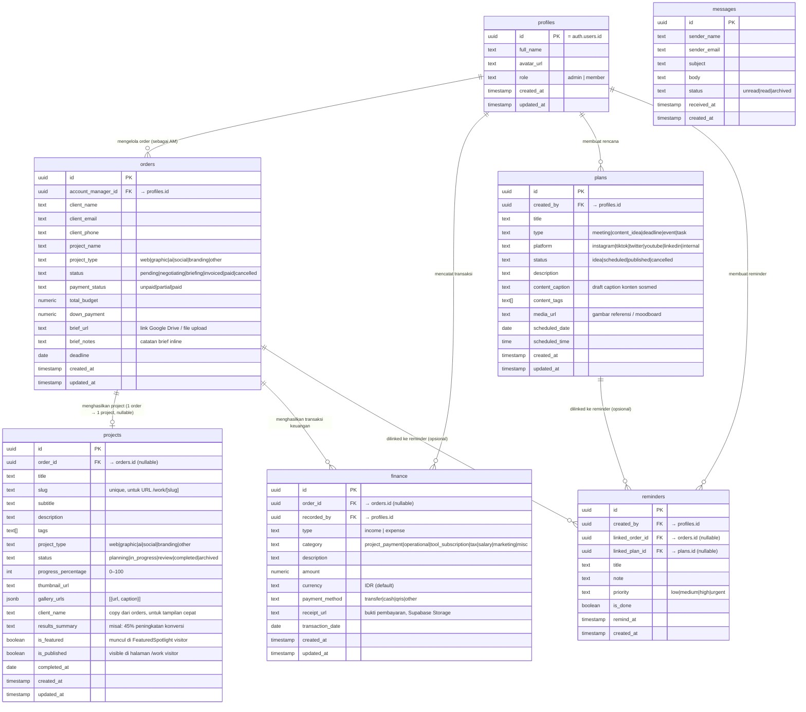

# Prawitech — PRD & ERD Management System
**Versi:** 2.0 (Fresh Rewrite)  
**Stack:** Next.js App Router · Supabase PostgreSQL · Supabase Auth · Supabase Storage

---

## BAGIAN 1 — ERD (Entity Relationship Diagram)

> Ini adalah blueprint database. Setiap kotak = 1 tabel. Garis = relasi antar tabel.



---

## BAGIAN 2 — Penjelasan Relasi (Plain Language)

| Relasi | Arah | Keterangan |
|---|---|---|
| `profiles` → `orders` | 1 orang bisa pegang banyak order | Kolom `account_manager_id` di `orders` menunjuk ke `profiles.id` |
| `orders` → `projects` | 1 order menghasilkan 1 project showcase | Kolom `order_id` di `projects` menunjuk ke `orders.id`. **Nullable** — project bisa berdiri sendiri tanpa order (untuk showcase internal) |
| `orders` → `finance` | 1 order bisa punya banyak transaksi | Kolom `order_id` di `finance` menunjuk ke `orders.id`. **Nullable** — pengeluaran umum boleh tidak terkait order |
| `profiles` → `finance` | Siapa yang input transaksi | Kolom `recorded_by` di `finance` menunjuk ke `profiles.id` |
| `profiles` → `plans` | Siapa yang buat rencana | Kolom `created_by` di `plans` menunjuk ke `profiles.id` |
| `reminders` → `orders` / `plans` | Reminder bisa dikaitkan ke order atau plan | Dua FK opsional: `linked_order_id` dan `linked_plan_id`. Boleh keduanya null |

---

## BAGIAN 3 — PRD Per Modul

---

### MODUL 1 — Dashboard `/admin`

**Tujuan:** Ringkasan bisnis + manajemen reminder harian.

**Kondisi sekarang:**
- Menampilkan 4 kartu jumlah (orders, projects, finance entries, plans)
- Data dari Supabase sudah terhubung

**Yang perlu ditambah:**

#### A. Summary Cards (baris atas)
| Kartu | Sumber Data | Cara Hitung |
|---|---|---|
| Active Orders | tabel `orders` | COUNT WHERE status NOT IN ('paid','cancelled') |
| Revenue Bulan Ini | tabel `finance` | SUM amount WHERE type='income' AND bulan ini |
| Expense Bulan Ini | tabel `finance` | SUM amount WHERE type='expense' AND bulan ini |
| Net Profit | kalkulasi | Revenue − Expense |

#### B. Widget Reminder
- Tampil semua `reminders` WHERE `is_done = false`, diurutkan: `urgent` → `high` → `medium` → `low`
- **Aksi per reminder:**
  - ✅ Centang selesai → update `is_done = true`
  - ✍️ Edit judul/catatan
  - 🗑️ Hapus (langsung, tanpa konfirmasi — low risk)
- **Tombol "+ Reminder"** → form mini: title, priority, opsional link ke order atau plan

#### C. Strip Deadline Mendekat
- Order dengan `deadline` dalam 14 hari ke depan
- Warna chip: 🔴 < 3 hari · 🟠 3–7 hari · ⚪ 7–14 hari

**Tabel yang dipakai:** `orders`, `finance`, `reminders`

---

### MODUL 2 — Orders `/admin/orders`

**Tujuan:** Mengelola pipeline order klien dari pertama kontak sampai lunas.

**Kondisi sekarang:**
- ✅ Kanban board dengan 6 kolom status sudah ada
- ✅ Data dari Supabase sudah terhubung (termasuk `account_manager`)
- ❌ Belum ada Create / Edit / Delete

**Yang perlu dibangun:**

#### CRUD — Create Order
Form di Drawer kanan. Field:

| Field | Tipe | Wajib? | Catatan |
|---|---|---|---|
| `client_name` | Text | ✅ | Nama klien |
| `client_email` | Email | ❌ | Format email |
| `client_phone` | Text | ❌ | Nomor HP |
| `project_name` | Text | ✅ | Nama project |
| `project_type` | Select | ✅ | web / graphic / ai / social / branding / other |
| `status` | Select | ✅ | Default: pending |
| `payment_status` | Select | ✅ | Default: unpaid |
| `total_budget` | Angka | ❌ | Format IDR |
| `down_payment` | Angka | ❌ | Harus ≤ total_budget |
| `account_manager_id` | Select dari `profiles` | ❌ | Pilih tim yang handle |
| `deadline` | Date picker | ❌ | |
| `brief_notes` | Textarea | ❌ | Catatan brief langsung |
| `brief_url` | URL input | ❌ | Link Google Drive |

#### CRUD — Edit Order
- Klik kartu → drawer terbuka dengan semua field sudah terisi
- Di bagian bawah drawer: tampilkan daftar transaksi `finance` yang terhubung (read-only)

#### CRUD — Delete Order
- Konfirmasi dialog
- Hard delete

#### Status Kanban — Update Status
- Klik tombol di kartu untuk pindah kolom (bukan drag-drop dulu, itu stretch goal)
- Update kolom `status` via Supabase

**Status & warna badge:**
| Status | Warna |
|---|---|
| `pending` | Abu (slate) |
| `negotiating` | Kuning (amber) |
| `briefing` | Biru (blue) |
| `invoiced` | Ungu (purple) |
| `paid` | Hijau (emerald) |
| `cancelled` | Merah (rose) |

**Tabel yang dipakai:** `orders`, `profiles` (untuk dropdown AM)

---

### MODUL 3 — Work `/admin/work` (CMS)

**Tujuan:** Mengelola konten showcase yang ditampilkan di halaman visitor `/work/[slug]`.

**Kondisi sekarang:**
- ✅ Grid card project dengan tab Active / Archive
- ✅ Data dari Supabase sudah terhubung, join ke `orders`
- ✅ Menampilkan progress bar
- ❌ Belum ada Create / Edit / Delete
- ❌ Halaman visitor `/work` masih pakai data statis dari `lib/projects.js`

**Yang perlu dibangun:**

#### CRUD — Create Project
Form di Drawer kanan. Field:

| Field | Tipe | Wajib? | Catatan |
|---|---|---|---|
| `title` | Text | ✅ | Nama project |
| `slug` | Text | ✅ | Auto-generate dari title, bisa edit manual. Harus unik. Dipakai untuk URL `/work/[slug]` |
| `subtitle` | Text | ❌ | Tagline singkat |
| `description` | Textarea | ❌ | Deskripsi panjang |
| `project_type` | Select | ❌ | web / graphic / ai / social / branding / other |
| `order_id` | Select dari `orders` | ❌ | Hubungkan ke order klien. Kosongkan untuk project internal |
| `client_name` | Text | ❌ | Auto-isi dari order jika dipilih. Bisa edit manual |
| `tags` | Tag input | ❌ | Array string, e.g. React, Branding, 2024 |
| `results_summary` | Text | ❌ | Hasil terukur, tampil di kartu visitor |
| `thumbnail_url` | Upload gambar | ❌ | Upload ke Supabase Storage bucket `projects` |
| `gallery_urls` | Upload multi-gambar | ❌ | Maks 8 foto, tersimpan sebagai JSONB |
| `status` | Select | ✅ | planning / in_progress / review / completed / archived |
| `progress_percentage` | Slider 0–100 | ❌ | |
| `is_published` | Toggle | ❌ | TRUE = tampil di visitor `/work`. Default: FALSE |
| `is_featured` | Toggle | ❌ | TRUE = tampil di FeaturedSpotlight visitor. Default: FALSE |
| `completed_at` | Date picker | ❌ | |

#### CRUD — Edit Project
- Klik kartu → drawer pre-filled
- Gallery manager: lihat foto yang ada, hapus, upload baru, drag reorder

#### CRUD — Delete Project
- Pilihan: Arsip (ubah `status = archived`, `is_published = false`) atau Hapus Permanen
- Default aksi: Arsip

#### Migrasi Halaman Visitor
> ⚠️ Ini penting: halaman `/work` dan `/work/[slug]` visitor sekarang baca dari file statis `lib/projects.js`. Harus dimigrasi baca dari tabel `projects` di Supabase.

- `app/work/page.jsx` → query `projects` WHERE `is_published = true`
- `app/work/[slug]/page.jsx` → query `projects` WHERE `slug = params.slug`

**Tabel yang dipakai:** `projects`, `orders` (untuk dropdown link order)

---

### MODUL 4 — Finance `/admin/finance`

**Tujuan:** Mencatat semua pemasukan dan pengeluaran agency.

**Kondisi sekarang:**
- ❌ Halaman placeholder, belum dibangun sama sekali

**Yang perlu dibangun:**

#### Baris Summary (atas halaman)
| Metric | Cara Hitung |
|---|---|
| Total Pemasukan | SUM `finance.amount` WHERE type='income', periode dipilih |
| Total Pengeluaran | SUM WHERE type='expense', periode dipilih |
| Keuntungan Bersih | Pemasukan − Pengeluaran |

Selector periode: Bulan Ini (default) / Bulan Lalu / Kuartal Ini / Semua

#### Tabel Transaksi
Kolom: Tanggal · Tipe (badge) · Kategori · Deskripsi · Order Terkait · Jumlah · Aksi

#### CRUD — Create Transaksi
Field:

| Field | Tipe | Wajib? | Catatan |
|---|---|---|---|
| `type` | Radio | ✅ | income atau expense |
| `category` | Select | ✅ | Pilihan berbeda tergantung type (lihat bawah) |
| `description` | Text | ✅ | Keterangan singkat |
| `amount` | Angka | ✅ | Format IDR, harus > 0 |
| `payment_method` | Select | ❌ | transfer / cash / qris / other |
| `transaction_date` | Date | ✅ | Default: hari ini |
| `order_id` | Select dari `orders` | ❌ | Opsional: kaitkan ke order klien |
| `receipt_url` | Upload gambar | ❌ | Bukti bayar ke Supabase Storage bucket `receipts` |

**Pilihan kategori:**
- Jika `income`: `project_payment`, `misc`
- Jika `expense`: `operational`, `tool_subscription`, `tax`, `salary`, `marketing`, `misc`

#### CRUD — Edit / Delete
- Edit via drawer
- Delete oleh admin saja, konfirmasi dialog

**Tabel yang dipakai:** `finance`, `orders` (dropdown), `profiles` (recorded_by)

---

### MODUL 5 — Plans `/admin/plans`

**Tujuan:** Kalender kegiatan + papan ide konten sosial media.

**Kondisi sekarang:**
- ❌ Halaman placeholder, belum dibangun

**Yang perlu dibangun:**

#### Toggle Tampilan
- 📅 **Calendar View** — grid bulanan, setiap plan = chip berwarna di tanggal yang dipilih
- 📋 **List View** — tabel diurutkan `scheduled_date ASC`
- 📌 **Board View** — kolom: Idea → Scheduled → Published → Cancelled

#### Filter
- Filter by `type`: Semua · Meeting · Konten · Deadline · Event · Task
- Filter by `platform`: Semua · Instagram · TikTok · Twitter · YouTube · LinkedIn · Internal
- Filter by `status`: Semua · Idea · Scheduled · Published · Cancelled

#### CRUD — Create Plan
Field:

| Field | Tipe | Wajib? | Catatan |
|---|---|---|---|
| `title` | Text | ✅ | |
| `type` | Select | ✅ | meeting / content_idea / deadline / event / task |
| `platform` | Select | ❌ | Hanya tampil jika type = content_idea |
| `status` | Select | ✅ | Default: idea |
| `description` | Textarea | ❌ | Catatan umum |
| `content_caption` | Textarea | ❌ | Hanya untuk content_idea. Draft caption sosmed |
| `content_tags` | Tag input | ❌ | Hanya untuk content_idea |
| `media_url` | Upload gambar | ❌ | Referensi visual / moodboard |
| `scheduled_date` | Date | ✅ | |
| `scheduled_time` | Time | ❌ | |

#### CRUD — Edit / Delete
- Edit via drawer
- Delete: konfirmasi dialog, hard delete

**Warna chip kalender by type:**
| Type | Warna |
|---|---|
| meeting | Biru |
| content_idea | Ungu |
| deadline | Merah |
| event | Kuning |
| task | Abu |

**Tabel yang dipakai:** `plans`, `profiles`

---

### MODUL 6 — Messages `/admin/messages`

**Tujuan:** Kotak masuk pesan dari form kontak di halaman visitor `/contact`.

**Kondisi sekarang:**
- ✅ Route ada di sidebar nav
- ❌ Halaman belum dibangun

**Yang perlu dibangun:**

#### Daftar Pesan
- List semua `messages` diurutkan `received_at DESC`
- Pesan belum dibaca: bold / background berbeda
- Filter: Semua · Belum Dibaca · Sudah Dibaca · Diarsipkan

#### Detail Pesan
- Klik baris → buka detail di drawer
- Otomatis tandai `status = read` saat dibuka

#### Aksi per Pesan
- Tandai Belum Dibaca / Sudah Dibaca
- Arsipkan → `status = archived`
- Hapus (admin only) → konfirmasi

#### Integrasi Form Kontak Visitor
- Form di `app/contact/page.jsx` submit ke Server Action
- Server Action INSERT ke tabel `messages` menggunakan Supabase anon key
- Tidak perlu login untuk kirim (visitor)

**Tabel yang dipakai:** `messages`

---

## BAGIAN 4 — Supabase Storage Buckets

| Bucket | Akses | Dipakai Untuk |
|---|---|---|
| `avatars` | Public | `profiles.avatar_url` |
| `projects` | Public | `projects.thumbnail_url` dan `projects.gallery_urls` |
| `briefs` | Private | `orders.brief_url` (dokumen brief klien) |
| `receipts` | Private | `finance.receipt_url` (bukti pembayaran) |
| `plans-media` | Private | `plans.media_url` (moodboard konten) |

---

## BAGIAN 5 — Urutan Build (Prioritas)

| Urutan | Modul | Alasan |
|---|---|---|
| 1 | **Orders** — CRUD | Sudah punya UI Kanban, tinggal tambah CRUD |
| 2 | **Work** — CRUD + Migrasi Visitor | CMS ini memblokir update konten live |
| 3 | **Finance** — Build dari nol | Dibutuhkan untuk metric di Dashboard |
| 4 | **Dashboard** — Widget tambahan | Butuh data Finance dulu baru bisa lengkap |
| 5 | **Plans** — Build dari nol | Fitur planning kalender |
| 6 | **Messages** — Build + integrasi form kontak | Integrasi visitor site |

---

## BAGIAN 6 — Pola Akses Data (Pattern)

### Read (Server Component)
```js
// Semua halaman admin pakai pattern ini
import { createClient } from "@/lib/supabase/server";
export const dynamic = "force-dynamic";

const supabase = await createClient();
const { data, error } = await supabase.from("orders").select("*");
```

### Write (Server Action)
```js
"use server";
import { createClient } from "@/lib/supabase/server";
import { revalidatePath } from "next/cache";

export async function createOrder(formData) {
  const supabase = await createClient();
  const { error } = await supabase.from("orders").insert({ ... });
  revalidatePath("/admin/orders");
}
```

### Join (Foreign Key)
```js
// Contoh sudah ada di orders/page.jsx
supabase.from("orders").select(`
  *,
  account_manager:account_manager_id ( full_name, avatar_url, role )
`)

// Contoh sudah ada di work/page.jsx
supabase.from("projects").select(`
  *,
  orders:order_id ( client_name, project_name, project_type )
`)
```

---

*End of PRD v2.0*
